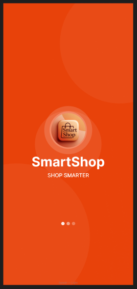
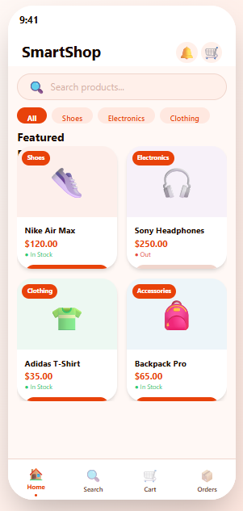
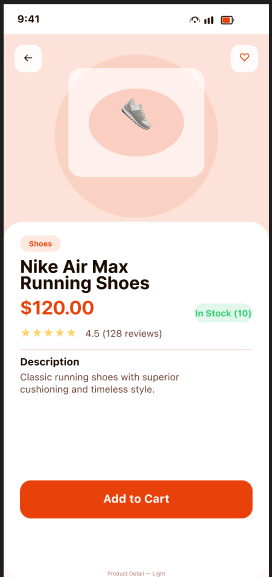
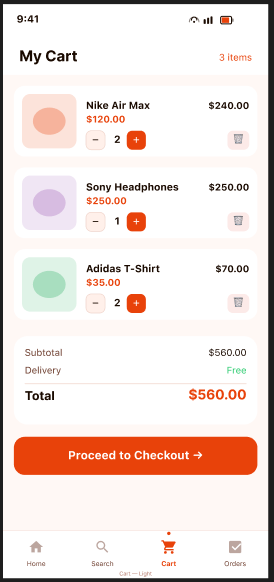

# SmartShop 🛍️

A full-featured Android e-commerce application built with modern
Android development practices.

## Screenshots
<!-- Add screenshots here after taking them -->

## Features
- 🔐 Firebase Authentication (Login, Register, Forgot Password)
- 🛍️ Product browsing with search and category filtering
- 🛒 Real-time shopping cart synced with Firestore
- 📦 Checkout with address form and order tracking
- 📋 Order history with status tracking
- 🌙 Dark mode support
- ✨ Shimmer loading animations
- 📱 Onboarding screens for first-time users

## Tech Stack
| Technology | Purpose |
|-----------|---------|
| Kotlin | Primary language |
| MVVM + Repository | Architecture pattern |
| Firebase Auth | User authentication |
| Firebase Firestore | Real-time database |
| Hilt | Dependency injection |
| Navigation Component | Screen navigation |
| ViewBinding | View access |
| Coroutines + Flow | Async operations |
| Glide | Image loading |
| Material Design 3 | UI components |
| DataStore | Local preferences |

## Architecture
```
UI (Fragment)
    ↓
ViewModel (StateFlow)
    ↓
Repository
    ↓
Firebase / DataStore
```

## Project Structure
```
com.smartshop.app/
├── data/
│   ├── model/        # Data classes
│   └── repository/   # Firebase logic
├── di/               # Hilt modules
├── ui/               # Fragments + ViewModels
│   ├── auth/
│   ├── cart/
│   ├── checkout/
│   ├── home/
│   ├── onboarding/
│   ├── orders/
│   ├── product/
│   └── splash/
└── utils/            # Extensions + helpers
```

## Setup

1. Clone the repository
```bash
git clone https://github.com/sovanna-dev/SmartShop.git
```

2. Create a Firebase project at console.firebase.google.com

3. Add Android app with package name: `com.smartshop.app`

4. Download `google-services.json` and place in `app/` folder

5. Enable these Firebase services:
    - Authentication → Email/Password
    - Firestore Database
    - (Optional) Storage

6. Build and run in Android Studio

## Git Flow
```
main        → production releases
develop     → integration branch
feature/*   → new features
hotfix/*    → urgent bug fixes
```

## License
MIT License — feel free to use this project for learning.

## Screenshots
| Figma Design | Splash |
|--------------|--------|
|  |  |

| Home | Detail |
|------|--------|
|  |  |

| Cart |        |
|------|--------|
|  |        |
